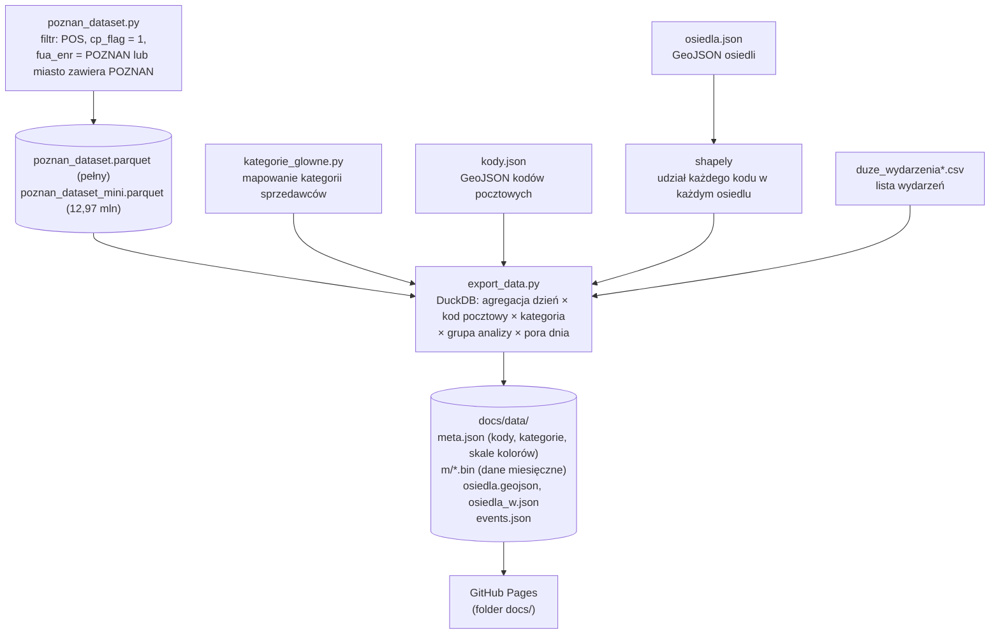
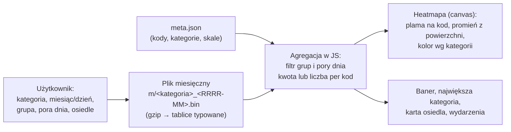
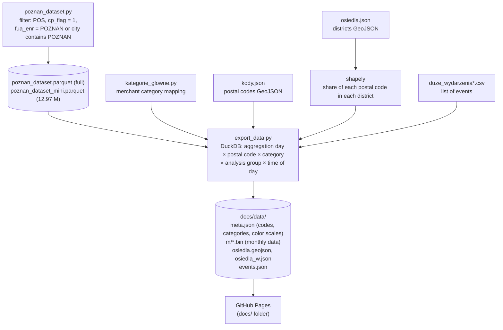
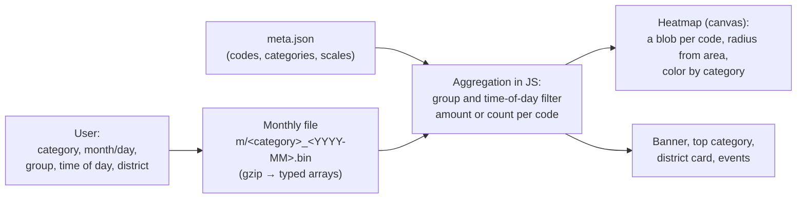

# Mapa transakcji kartowych w Poznaniu
## [English below :)](#card-transactions-map-of-poznań)

Interaktywna mapa (strona statyczna, działa na GitHub Pages), która pokazuje, **ile i gdzie w Poznaniu zostawiają pieniędzy różne grupy osób**: mieszkańcy Poznania, mieszkańcy obwarzanka, obcokrajowcy i osoby spoza metropolii. Dane pochodzą z syntetycznych, zanonimizowanych transakcji kartowych (hackathon DataSprint, Visa; kwoty w fikcyjnej walucie).

Strona: https://zuzannatabisz.github.io/app_datasprint/
Wideo z prezentacją: https://youtu.be/PpBBMPBr2LY

> [!TIP]
> ## 👉 [OTWÓRZ APLIKACJĘ](https://zuzannatabisz.github.io/app_datasprint/)
> **Naciśnij ▶ Play** i zobacz, jak dane zmieniają się w czasie.
> **Wybierz osiedle** i sprawdź, ile pieniędzy trafia do danej okolicy.

## Co potrafi aplikacja
- **Baner z kwotą:** „X zostawili w Poznaniu + Y” dla wybranych filtrów oraz największa kategoria wydatków z jej udziałem.
- **Heatmapa kodów pocztowych** rysowana wg **łącznej kwoty** (domyślnie) albo **liczby transakcji**. Promień plamy zależy od powierzchni kodu, kolor od kategorii (jasny = mało, ciemny = dużo).
- **Filtry:** kategoria (kategorie zagregowane), osiedle, grupa (wybór wielokrotny, dwuklik = tylko ta grupa), pora dnia (dzień 8–17 / wieczór-noc 18–7).
- **Oś czasu:** przełącznik per miesiąc / per dzień, strzałki, suwak dni, Play.
- **Osiedla:** 42 osiedla, wybór kliknięciem albo z listy. Karta pokazuje liczbę transakcji i średnią kwotę transakcji względem średniej (zielone „+”, czerwone „−”).
- **Wydarzenia w Poznaniu** z kwotą „dodatkowe wydatki ponad zwykły dzień” dla wybranych filtrów.
- Liczby transakcji poniżej 30 są pokazywane jako „<30” (ochrona małych liczb, przybliżenie wymogu 30 kart; patrz sekcja Compliance).

## Stack
| Warstwa | Technologie |
|---|---|
| Dane źródłowe | Parquet, słownik kolumn w Excelu (dane przekazane przez organizatorów) |
| Przetwarzanie | **Python 3.12**, **DuckDB** (agregacja bez ładowania pliku do RAM), **pandas**, **numpy**, **shapely** (przeliczenie kodów pocztowych na osiedla), `gzip`/`struct` (format binarny) |
| Środowisko | conda (`datasprint`, plik `environment.yaml`) |
| Dane geograficzne | GeoJSON: kody pocztowe (`kody.json`), osiedla (`osiedla.json`) |
| Frontend | HTML + CSS + JavaScript bez frameworka, **Leaflet 1.9.4**, własny renderer heatmapy na `canvas`, kafelki **Esri World Light Gray** |
| Format danych na stronie | miesięczne pliki `.bin` (gzip, tablice typowane) albo `.json` (awaryjnie) |
| Hosting | **GitHub Pages** (folder `docs/`) |
| Wizualizacja i plik HTML | Wizualizacja (mapa, heatmapa, karty) oraz plik `docs/index.html` powstały we **współpracy z Claude Code (AI, Anthropic)** |

Przeglądarka nie dostaje surowych rekordów, tylko agregaty. Wymagana jest nowsza przeglądarka (Chrome/Edge 80+, Firefox 126+, Safari 16.4+: `DecompressionStream`, CSS `zoom`).

## Pipeline
### 1. Przygotowanie danych (offline)


### 2. Działanie w przeglądarce

Strona ładuje tylko wybrany miesiąc (i w tle pozostałe kategorie tego miesiąca do policzenia największej kategorii), a skala kolorów jest wspólna dla wszystkich miesięcy dzięki maksimom wyliczonym w `export_data.py`.

## Jak ograniczyliśmy dane z pełnego pliku
Pełny plik `datasprint_sample_data.parquet` ma **305 mln wierszy i 30 kolumn (17,5 GB)**. Do pracy nad aplikacją zawęziliśmy go jednym zapytaniem (DuckDB, bez ładowania pliku do pamięci) do zbioru dotyczącego Poznania:

```sql
SELECT pymt_crd_acct_num_raw, mrch_catg_nm, mrch_city_nm_raw, mrch_postal_code, mrch_ctry_nm,
       mrch_nm_raw, issr_ctry_cd, prch_dt, prch_mnth_id, tran_id_gmt_tm, cs_tran_amt,
       lau_enr, fua_enr, pstl_cd_enr
FROM read_parquet('datasprint_sample_data.parquet')
WHERE transaction_type = 'POS'
  AND cp_flag = 1
  AND (fua_enr = 'POZNAN' OR UPPER(TRIM(mrch_city_nm_raw)) LIKE '%POZNAN%')
```

**Ograniczenie wierszy** (`WHERE`):
- `transaction_type = 'POS'`: tylko płatności w terminalach (bez bankomatów).
- `cp_flag = 1`: tylko płatności z fizyczną obecnością karty (bez płatności online i zdalnych).
- `fua_enr = 'POZNAN'` **lub** miasto sprzedawcy zawiera `POZNAN`: transakcje kart przypisanych do obszaru miejskiego Poznania (gdziekolwiek płacili) oraz wszystkie transakcje u sprzedawców w Poznaniu (także kart spoza Poznania, np. turystów).

**Ograniczenie kolumn:** z 30 kolumn zostawiliśmy 14 (lista w zapytaniu). Pominęliśmy m.in. identyfikator transakcji, segment karty, sposób odczytu karty, kod kategorii, region i kod kraju sprzedawcy, typ karty oraz kanał płatności.

**Wynik:** ok. **64 mln wierszy** (`poznan_dataset.parquet`, pełny zbiór używany do publikacji). Plik `poznan_dataset_mini.parquet` (12,97 mln wierszy) to mniejszy zbiór do szybkich testów. Następnie `export_data.py` zawęża dane do sprzedawców w Polsce z poprawnym kodem pocztowym i agreguje je do postaci opisanej poniżej.

**Ograniczenia tego podejścia:**
- Uwzględniamy tylko płatności kartą fizyczną w terminalach: bez bankomatów, płatności online i zdalnych.
- Miasto jest dopasowywane po tekście (`POZNAN`), więc zapisy ze skrótem lub literówką (np. „Pozna”, „Pozna?”) mogą zostać pominięte. Dodatkowo wybór po `fua_enr` obejmuje wszystkie transakcje mieszkańców obszaru Poznania, także te poza miastem.

## Z jakich kolumn korzysta eksport
| Kolumna | Użycie |
|---|---|
| `mrch_ctry_nm` | filtr: tylko `POLAND` |
| `mrch_postal_code` | **rejon heatmapy** (kod pocztowy sprzedawcy, normalizowany do `XX-XXX`) |
| `prch_dt` | dzień |
| `mrch_catg_nm` | kategoria (agregowana do kategorii głównych) |
| `tran_id_gmt_tm` | godzina UTC → pora dnia |
| `issr_ctry_cd` | `<> 616` = obcokrajowcy |
| `lau_enr` | grupa: Poznań, obwarzanek (lista 17 gmin), poza metropolią |
| `cs_tran_amt` | kwoty (łączna i średnia) |

Karta osiedla i heatmapa używają kodu pocztowego **sprzedawcy** (gdzie zapłacono), a nie miejsca zamieszkania karty.

## Definicje i założenia
- **Grupa analizy:** kraj wydawcy ≠ Polska → Obcokrajowcy; `lau_enr` = `POZNAN` → Poznań; `lau_enr` z listy gmin wokół Poznania → Obwarzanek; reszta → Poza metropolią.
- **Pora dnia:** godziny z `tran_id_gmt_tm` (UTC): 8–17 dzień, 18–7 wieczór/noc.
- **„W Poznaniu”:** kody pocztowe przeliczone na osiedla wagami z `osiedla_w.json` (udział powierzchni kodu w osiedlu), zakładając równomierny rozkład transakcji w obrębie kodu. To przybliżenie.
- **Dodatkowe wydatki wydarzenia:** kwota z dni wydarzenia minus liczba dni × średnia dzienna kwota z dni tego samego miesiąca bez żadnego wydarzenia. To prosty szacunek, który nie uwzględnia dnia tygodnia ani świąt, i nie dowodzi związku przyczynowego.
- **Największa kategoria** jest liczona po wszystkich kategoriach niezależnie od wyboru kategorii.

## Compliance (wymogi regulacyjne wyzwania)
Wymogi z opisu wyzwania: (1) brak możliwości identyfikacji pojedynczych osób, czyli analizy i prezentacje tylko na grupach obejmujących **co najmniej 30 kart**; (2) każda grupa porównawcza obejmuje **co najmniej 3 podmioty/graczy**, a udział żadnego z nich nie przekracza **75%** grupy. Rozwiązanie nie może umożliwiać identyfikacji pojedynczych użytkowników, kart, transakcji ani podmiotów.

### Zastosowane środki
- **Tylko agregaty.** Na stronę trafiają wyłącznie sumy i liczby dla komórek *dzień × kod pocztowy × kategoria × grupa analizy × pora dnia*. Nie publikujemy numerów kart (`pymt_crd_acct_num_raw` nie jest używany w eksporcie), nazw sprzedawców (`mrch_nm_raw`), pojedynczych transakcji ani godzin z dokładnością do minut. Przeglądarka nie dostaje surowych rekordów.
- **Wyniki dla grup, nie dla osób.** Prezentowane są kody pocztowe, osiedla, kategorie i grupy (Poznań, obwarzanek, obcokrajowcy, poza metropolią), a nie użytkownicy.
- **Maskowanie małych liczb w interfejsie.** Liczba transakcji poniżej 30 jest pokazywana jako „<30” (okno statystyk, punkty kodów, karta osiedla, lista kategorii).
- **Parametr `MIN_N`** w `export_data.py` pozwala usunąć z publikowanych plików komórki z mniejszą liczbą transakcji.

### Stan spełnienia wymogów
Prototyp **nie egzekwuje jeszcze w pełni progów**:
- maskowanie „<30” dotyczy liczby **transakcji**, a nie **kart** (jest przybliżeniem wymogu 30 kart, eksport nie liczy unikalnych kart),
- małe komórki nie są jeszcze usuwane z publikowanych plików (`MIN_N = 1`), a maskowanie działa tylko w interfejsie,
- warunek min. 3 podmiotów i maksymalnie 75% udziału jednego z nich nie jest jeszcze sprawdzany.

Egzekwowanie progów na etapie eksportu (liczenie unikalnych kart i sprzedawców, usuwanie komórek poniżej progów) jest kolejnym krokiem rozwoju przed ewentualnym wdrożeniem.

## Źródła danych i atrybucja
- **Transakcje:** syntetyczne dane transakcyjne Visa, udostępnione przez organizatorów hackathonu DataSprint.
- **Osiedla (GeoJSON):** dane publiczne Smart City Poznań.
- **Wydarzenia:** kalendarium grupy MTP / badam.poznan.pl / Platforma Otwartych Danych Poznania.
- **Kody pocztowe (GeoJSON):** *źródło do uzupełnienia*.
- **Mapa podkładowa:** kafelki Esri World Light Gray, biblioteka Leaflet.

## Uruchomienie
Aby tylko obejrzeć aplikację, wystarczy otworzyć link do strony: gotowe dane są w folderze `docs/data`, a pliki Parquet nie są potrzebne.

Aby wygenerować dane od nowa, potrzebne są pliki Parquet, których **nie ma w repozytorium** (`*.parquet` jest w `.gitignore`). Umieść je w głównym folderze repozytorium: `poznan_dataset_mini.parquet` (szybki test) i/lub `poznan_dataset.parquet` (pełny zbiór, do publikacji). Pliki `kody.json`, `osiedla.json` i `duze_wydarzenia*.csv` są w repozytorium.

### 1. Wygeneruj dane
```
git clone https://github.com/ZuzannaTabisz/app_datasprint
cd app_datasprint
conda env create -f environment.yaml
conda activate datasprint
python export_data.py --dataset mini
```
`--dataset mini` to mniejszy zbiór do szybkiego testu, `--dataset full` to pełny zbiór (tak generujemy dane do publikacji), a `--parquet ŚCIEŻKA` wskazuje dowolny plik. Ustawienia na górze `export_data.py`: `DATASET`, `KOD_PREFIKSY`, `KATEGORIE` (`glowne` lub `szczegolowe`), `FORMAT` (`bin` lub `json`), `MIN_N`. Skrypt wypisuje rozmiar wyników i największego pliku miesięcznego.

### 2. Sprawdź lokalnie
Uruchom serwer:
```
cd docs
python -m http.server 8000
```
i otwórz http://localhost:8000

### 3. Strona opublikowana na GitHub Pages
```
https://zuzannatabisz.github.io/app_datasprint/index.html
```

---

# Card Transactions Map of Poznań
## [Polska wersja powyżej](#mapa-transakcji-kartowych-w-poznaniu)

An interactive map (static site, hosted on GitHub Pages) showing **how much money different groups of people leave in Poznań, and where**: Poznań residents, residents of the "obwarzanek" (the ring of municipalities around Poznań), foreigners, and people from outside the metropolitan area. The data comes from synthetic, anonymized card transactions (DataSprint hackathon, Visa; amounts are in a fictional currency).

Website: https://zuzannatabisz.github.io/app_datasprint/
Presentation video: https://youtu.be/PpBBMPBr2LY

> [!TIP]
> ## 👉 [OPEN THE APP](https://zuzannatabisz.github.io/app_datasprint/)
> **Press ▶ Play** and watch how the data changes over time.
> **Select a district** and see how much money flows into that area.

## What the app can do
- **A headline banner:** "X left in Poznań + Y" for the selected filters, plus the largest spending category with its share.
- **A postal-code heatmap** drawn by **total amount** (default) or **number of transactions**. The size of each blob depends on the area of the postal code, and the color depends on the category (light = low, dark = high).
- **Filters:** category (aggregated categories), district, group (multi-select; double-click = only that group), time of day (day 8–17 / evening–night 18–7).
- **Timeline:** per month / per day switch, arrows, day slider, Play.
- **Districts:** 42 districts, selectable by clicking on the map or from a list. The card shows the number of transactions and the average transaction amount compared with the average (green "+", red "−").
- **Events in Poznań** with the amount of "additional spending above a regular day" for the selected filters.
- Transaction counts below 30 are shown as "<30" (small-number protection, an approximation of the 30-card requirement; see the Compliance section).

## Stack
| Layer | Technologies |
|---|---|
| Source data | Parquet, column dictionary in Excel (data provided by the organizers) |
| Processing | **Python 3.12**, **DuckDB** (aggregation without loading the file into RAM), **pandas**, **numpy**, **shapely** (converting postal codes to districts), `gzip`/`struct` (binary format) |
| Environment | conda (`datasprint`, `environment.yaml` file) |
| Geographic data | GeoJSON: postal codes (`kody.json`), districts (`osiedla.json`) |
| Frontend | HTML + CSS + JavaScript without a framework, **Leaflet 1.9.4**, custom `canvas` heatmap renderer, **Esri World Light Gray** tiles |
| Data format on the site | monthly `.bin` files (gzip, typed arrays) or `.json` (fallback) |
| Hosting | **GitHub Pages** (`docs/` folder) |
| Visualization and HTML file | The visualization (map, heatmap, cards) and the `docs/index.html` file were created in **collaboration with Claude Code (AI, Anthropic)** |

The browser does not receive raw records, only aggregates. A modern browser is required (Chrome/Edge 80+, Firefox 126+, Safari 16.4+: `DecompressionStream`, CSS `zoom`).

## Pipeline
### 1. Data preparation (offline)


### 2. How it works in the browser

The site loads only the selected month (and, in the background, the other categories of that month in order to compute the top category). The color scale is shared across all months thanks to the maximum values computed in `export_data.py`.

## How we reduced the full dataset
The full file `datasprint_sample_data.parquet` has **305 million rows and 30 columns (17.5 GB)**. To work on the app, we narrowed it down with a single query (DuckDB, without loading the file into memory) to a dataset about Poznań:

```sql
SELECT pymt_crd_acct_num_raw, mrch_catg_nm, mrch_city_nm_raw, mrch_postal_code, mrch_ctry_nm,
       mrch_nm_raw, issr_ctry_cd, prch_dt, prch_mnth_id, tran_id_gmt_tm, cs_tran_amt,
       lau_enr, fua_enr, pstl_cd_enr
FROM read_parquet('datasprint_sample_data.parquet')
WHERE transaction_type = 'POS'
  AND cp_flag = 1
  AND (fua_enr = 'POZNAN' OR UPPER(TRIM(mrch_city_nm_raw)) LIKE '%POZNAN%')
```

**Row reduction** (`WHERE`):
- `transaction_type = 'POS'`: only terminal payments (no ATM withdrawals).
- `cp_flag = 1`: only payments with the physical card present (no online or remote payments).
- `fua_enr = 'POZNAN'` **or** the merchant's city contains `POZNAN`: transactions by cards assigned to the Poznań urban area (wherever they paid) and all transactions at merchants in Poznań (including cards from outside Poznań, e.g. tourists).

**Column reduction:** out of 30 columns we kept 14 (listed in the query). We left out, among others, the transaction ID, card segment, card entry mode, category code, merchant region and country code, card type, and payment channel.

**Result:** about **64 million rows** (`poznan_dataset.parquet`, the full dataset used for publication). The file `poznan_dataset_mini.parquet` (12.97 million rows) is a smaller dataset for quick tests. Then `export_data.py` narrows the data to merchants in Poland with a valid postal code and aggregates them into the form described below.

**Limitations of this approach:**
- We include only in-person card payments at terminals: no ATMs, online or remote payments.
- The city is matched by text (`POZNAN`), so records with an abbreviation or a typo (e.g. "Pozna", "Pozna?") may be missed. In addition, selecting by `fua_enr` includes all transactions of residents of the Poznań area, also those outside the city.

## Columns used by the export
| Column | Usage |
|---|---|
| `mrch_ctry_nm` | filter: `POLAND` only |
| `mrch_postal_code` | **heatmap area** (merchant postal code, normalized to `XX-XXX`) |
| `prch_dt` | day |
| `mrch_catg_nm` | category (aggregated into main categories) |
| `tran_id_gmt_tm` | UTC hour → time of day |
| `issr_ctry_cd` | `<> 616` = foreigners |
| `lau_enr` | group: Poznań, obwarzanek (list of 17 municipalities), outside the metropolitan area |
| `cs_tran_amt` | amounts (total and average) |

The district card and the heatmap use the **merchant's** postal code (where the payment was made), not the cardholder's place of residence.

## Definitions and assumptions
- **Analysis group:** issuer country ≠ Poland → Foreigners; `lau_enr` = `POZNAN` → Poznań; `lau_enr` from the list of municipalities around Poznań → Obwarzanek; everything else → Outside the metropolitan area.
- **Time of day:** hours from `tran_id_gmt_tm` (UTC): 8–17 day, 18–7 evening/night.
- **"In Poznań":** postal codes converted to districts using weights from `osiedla_w.json` (the share of the postal code's area within the district), assuming an even distribution of transactions within a postal code. This is an approximation.
- **Additional event spending:** the amount on the event days minus the number of days × the average daily amount from the days of the same month without any event. This is a simple estimate that does not account for the day of the week or public holidays, and it does not prove causation.
- **The top category** is calculated across all categories, regardless of the selected category.

## Compliance (regulatory requirements of the challenge)
Requirements from the challenge description: (1) no possibility of identifying individuals, i.e. analyses and presentations only for groups of **at least 30 cards**; (2) each comparison group includes **at least 3 entities/players**, and no single one of them exceeds **75%** of the group. The solution must not allow identification of individual users, cards, transactions or entities.

### Measures applied
- **Aggregates only.** Only sums and counts for cells of *day × postal code × category × analysis group × time of day* are published on the site. We do not publish card numbers (`pymt_crd_acct_num_raw` is not used in the export), merchant names (`mrch_nm_raw`), individual transactions, or times down to the minute. The browser does not receive raw records.
- **Results for groups, not for individuals.** The presented units are postal codes, districts, categories and groups (Poznań, obwarzanek, foreigners, outside the metropolitan area), not users.
- **Masking of small numbers in the interface.** A transaction count below 30 is shown as "<30" (statistics panel, code points, district card, category list).
- **The `MIN_N` parameter** in `export_data.py` allows removing cells with a smaller number of transactions from the published files.

### Compliance status
The prototype **does not yet fully enforce the thresholds**:
- the "<30" masking applies to the number of **transactions**, not **cards** (it is an approximation of the 30-card requirement; the export does not count unique cards),
- small cells are not yet removed from the published files (`MIN_N = 1`), and masking works only in the interface,
- the condition of at least 3 entities and at most 75% share for any one of them is not yet checked.

Enforcing the thresholds at the export stage (counting unique cards and merchants, removing cells below the thresholds) is the next development step before any deployment.

## Data sources and attribution
- **Transactions:** synthetic Visa transaction data, provided by the organizers of the DataSprint hackathon.
- **Districts (GeoJSON):** public data from Smart City Poznań.
- **Events:** calendar of the MTP group / badam.poznan.pl / Poznań Open Data Platform.
- **Postal codes (GeoJSON):** *source to be added*.
- **Base map:** Esri World Light Gray tiles, Leaflet library.

## Running the project
To just view the app, open the site link: the ready-made data is in the `docs/data` folder and the Parquet files are not needed.

To regenerate the data, you need the Parquet files, which are **not in the repository** (`*.parquet` is in `.gitignore`). Place them in the repository's main folder: `poznan_dataset_mini.parquet` (quick test) and/or `poznan_dataset.parquet` (full dataset, used for publication). The files `kody.json`, `osiedla.json` and `duze_wydarzenia*.csv` are in the repository.

### 1. Generate the data
```
git clone https://github.com/ZuzannaTabisz/app_datasprint
cd app_datasprint
conda env create -f environment.yaml
conda activate datasprint
python export_data.py --dataset mini
```
`--dataset mini` is a smaller dataset for a quick test, `--dataset full` is the full dataset (this is how we generate the data for publication), and `--parquet PATH` points to any other file. Settings at the top of `export_data.py`: `DATASET`, `KOD_PREFIKSY`, `KATEGORIE` (`glowne` or `szczegolowe`), `FORMAT` (`bin` or `json`), `MIN_N`. The script prints the size of the output and of the largest monthly file.

### 2. Check locally
Start a server:
```
cd docs
python -m http.server 8000
```
and open http://localhost:8000

### 3. The site published on GitHub Pages
```
https://zuzannatabisz.github.io/app_datasprint/index.html
```
