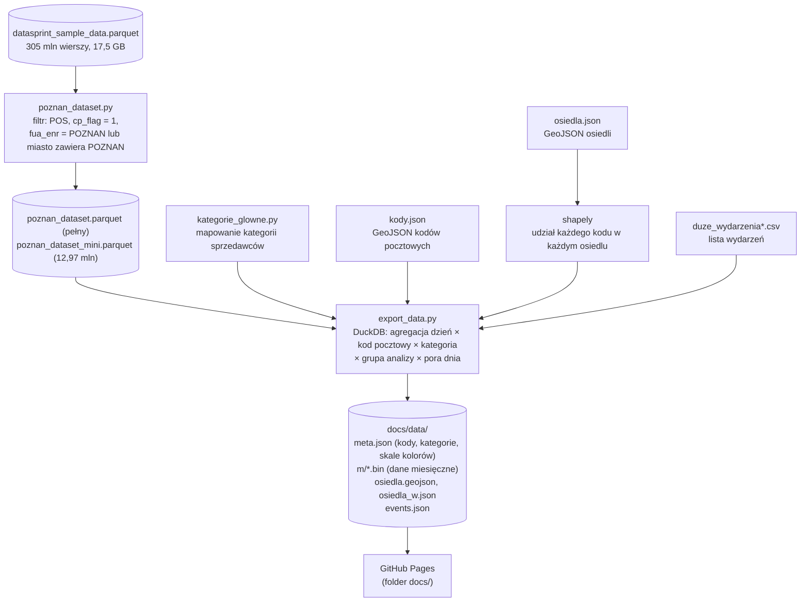
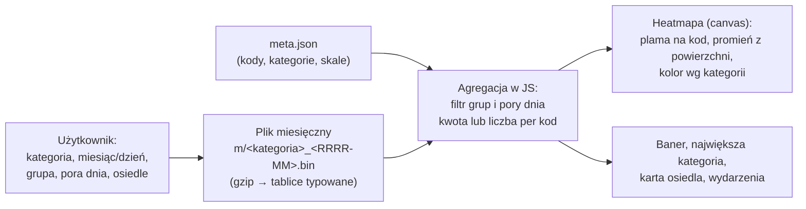

# Mapa transakcji kartowych w Poznaniu

Interaktywna mapa (strona statyczna, działa na GitHub Pages), która pokazuje, **ile i gdzie w Poznaniu zostawiają pieniędzy różne grupy osób**: mieszkańcy Poznania, mieszkańcy obwarzanka, obcokrajowcy i osoby spoza metropolii. Dane pochodzą z syntetycznych, zanonimizowanych transakcji kartowych (hackathon DataSprint, Visa; kwoty w fikcyjnej walucie).

Strona: https://zuzannatabisz.github.io/app_datasprint/

## Co potrafi aplikacja
- **Baner z kwotą:** „X zostawili w Poznaniu + Y” dla wybranych filtrów oraz największa kategoria wydatków z jej udziałem.
- **Heatmapa kodów pocztowych** rysowana wg **łącznej kwoty** (domyślnie) albo **liczby transakcji**. Promień plamy zależy od powierzchni kodu, kolor od kategorii (jasny = mało, ciemny = dużo).
- **Filtry:** kategoria (kategorie zagregowane), osiedle, grupa (wybór wielokrotny, dwuklik = tylko ta grupa), pora dnia (dzień 8–17 / wieczór-noc 18–7).
- **Oś czasu:** przełącznik per miesiąc / per dzień, strzałki, suwak dni, Play.
- **Osiedla:** 42 osiedla, wybór kliknięciem albo z listy. Karta pokazuje liczbę transakcji i średnią kwotę transakcji względem średniej (zielone „+”, czerwone „−”).
- **Wydarzenia w Poznaniu** z kwotą „dodatkowe wydatki ponad zwykły dzień” dla wybranych filtrów.
- Liczby transakcji poniżej 30 są pokazywane jako „<30”.

## Stack
| Warstwa | Technologie |
|---|---|
| Dane źródłowe | Parquet (17,5 GB, 305 mln wierszy), słownik kolumn w Excelu |
| Przetwarzanie | **Python 3.12**, **DuckDB** (agregacja bez ładowania pliku do RAM), **pandas**, **numpy**, **shapely** (przeliczenie kodów pocztowych na osiedla), `gzip`/`struct` (format binarny) |
| Środowisko | conda (`datasprint`, kanał conda-forge) |
| Dane geograficzne | GeoJSON: kody pocztowe (`kody.json`), osiedla (`osiedla.json`) |
| Frontend | HTML + CSS + JavaScript bez frameworka, **Leaflet 1.9.4**, własny renderer heatmapy na `canvas`, kafelki **Esri World Light Gray** |
| Format danych na stronie | miesięczne pliki `.bin` (gzip, tablice typowane) albo `.json` (awaryjnie) |
| Hosting | **GitHub Pages** (folder `docs/`) |

Przeglądarka nie dostaje surowych rekordów, tylko agregaty. Wymagana jest nowsza przeglądarka (Chrome/Edge 80+, Firefox 126+, Safari 16.4+: `DecompressionStream`, CSS `zoom`).

## Pipeline
### 1. Przygotowanie danych (offline)


### 2. Działanie w przeglądarce

Strona ładuje tylko wybrany miesiąc (i w tle pozostałe kategorie tego miesiąca do policzenia największej kategorii), a skala kolorów jest wspólna dla wszystkich miesięcy dzięki maksimom wyliczonym w `export_data.py`.

## Z jakich kolumn korzysta eksport
| Kolumna | Użycie |
|---|---|
| `mrch_ctry_nm` | filtr: tylko `POLAND` |
| `mrch_postal_code` | **rejon heatmapy** (kod pocztowy sprzedawcy, normalizowany do `XX-XXX`) |
| `prch_dt` | dzień |
| `mrch_catg_nm` | kategoria (agregowana do kategorii głównych) |
| `tran_id_gmt_tm` | godzina UTC → pora dnia |
| `issr_ctry_cd` | `<> 616` = obcokrajowcy |
| `lau_enr` | grupa: Poznań, obwarzanek (lista 17 gmin), poza metropolią |
| `cs_tran_amt` | kwoty (łączna i średnia) |

Karta osiedla i heatmapa używają kodu pocztowego **sprzedawcy** (gdzie zapłacono), a nie miejsca zamieszkania karty.

## Definicje i założenia
- **Grupa analizy:** kraj wydawcy ≠ Polska → Obcokrajowcy; `lau_enr` = `POZNAN` → Poznań; `lau_enr` z listy gmin wokół Poznania → Obwarzanek; reszta → Poza metropolią.
- **Pora dnia:** godziny z `tran_id_gmt_tm` (UTC): 8–17 dzień, 18–7 wieczór/noc.
- **„W Poznaniu”:** kody pocztowe przeliczone na osiedla wagami z `osiedla_w.json` (udział powierzchni kodu w osiedlu), zakładając równomierny rozkład transakcji w obrębie kodu. To przybliżenie.
- **Dodatkowe wydatki wydarzenia:** kwota z dni wydarzenia minus liczba dni × średnia dzienna kwota z dni tego samego miesiąca bez żadnego wydarzenia. To prosty szacunek, który nie uwzględnia dnia tygodnia ani świąt, i nie dowodzi związku przyczynowego.
- **Największa kategoria** jest liczona po wszystkich kategoriach niezależnie od wyboru kategorii.

## Uruchomienie
Pliki wejściowe leżą w folderze `app/` (nie trafiają do repozytorium: `*.parquet` jest w `.gitignore`):
`poznan_dataset_mini.parquet`, `poznan_dataset.parquet`, `kody.json`, `osiedla.json`, `duze_wydarzenia*.csv`.

### 1. Wygeneruj dane
```
conda activate datasprint
conda install -y -c conda-forge shapely
cd app
python export_data.py --dataset mini
```
`--dataset full` używa pełnego zbioru, `--parquet ŚCIEŻKA` dowolnego pliku. Ustawienia na górze `export_data.py`: `DATASET`, `KOD_PREFIKSY`, `KATEGORIE` (`glowne` lub `szczegolowe`), `FORMAT` (`bin` lub `json`), `MIN_N`. Skrypt wypisuje rozmiar wyników i największego pliku miesięcznego.

### 2. Sprawdź lokalnie
`fetch` nie działa przy otwarciu pliku z dysku, więc uruchom serwer:
```
cd docs
python -m http.server 8000
```
i otwórz http://localhost:8000

### 3. Opublikuj na GitHub Pages
```
git add docs export_data.py kategorie_glowne.py kody.json osiedla.json duze_wydarzenia_Poznan_2025-01-01_2026-06-30.csv README.md .gitignore
git commit -m "opis zmiany"
git push
```
Settings → Pages → Deploy from a branch → `main` → `/docs`. Nie używaj `git add .` (pliki Parquet przekraczają limit GitHuba 100 MB na plik).

## Uwagi
- Dane w repozytorium są publiczne: agregaty po kodzie pocztowym, kategorii, grupie, porze dnia i dniu. Do ukrycia małych liczb służy `MIN_N` w `export_data.py`.
- Jeśli format binarny sprawia problemy w przeglądarce, ustaw `FORMAT = "json"` i uruchom eksport ponownie.
- Aplikacja jest nieprzetestowana automatycznie; opisane zachowanie wynika z kodu.
